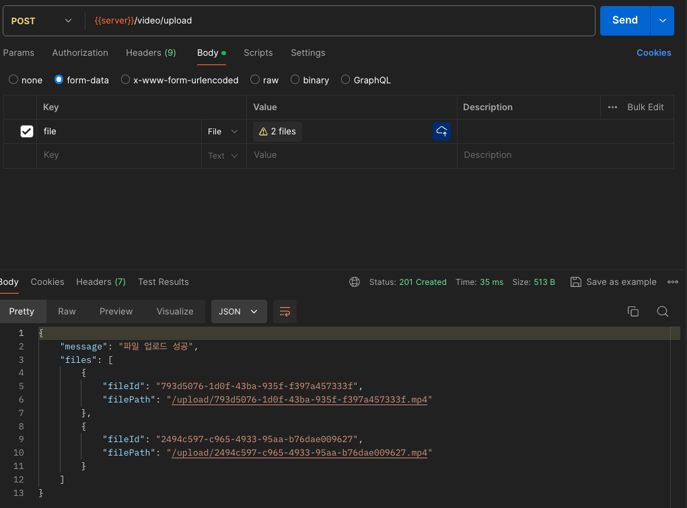

# 백엔드 개발과제

## 기술 스택

- **프레임워크**: NestJS
- **파일 업로드**: Multer
- **동영상 처리**: FFmpeg

### 1. 요구 사항

- Node.js (v14 이상)
- Yarn (v1.22 이상)
- **FFmpeg**: 동영상 처리용 도구

### 2. 리포지토리 클론
git clone을 해주세요
```bash
git clone https://github.com/hunit90/video-upload-api.git
```

### 3. 의존성 설치
Yarn을 사용하여 필요한 의존성을 설치합니다.
```bash
yarn install
```

### 4. 애플리케이션 실행
```bash
yarn start:dev
```
서버는 http://localhost:3000에서 실행됩니다.

### 5. 테스트 진행방법
1. 동영상 업로드

root directory에 upload 폴더를 생성해주세요.

- 동영상 파일을 업로드하는 API입니다.
- 아래와 같은 형식으로 요청할 수 있습니다.

POST http://localhost:3000/video/upload 



2. 업로드된 동영상 리스트

GET http://localhost:3000/video/list

3. 동영상 컷편집 Trim

- 지정한 시작 시간과 종료 시간에 따라 동영상을 잘라냅니다.

POST http://localhost:3000/video/trim  

```json
{
  "fileId": "db8995c4-be7e-4184-8841-56c2f82df93b",
  "trim_start": 10,
  "trim_end": 20
}
```

4. 동영상 이어 붙이기 (Concat)

POST http://localhost:3000/video/concat

```json
{
  "fileIds": [
    "5e84667d-4819-4aec-aacc-637ecae03cf0",
    "b7fa1a80-267e-4513-8b09-dd8522fc2617",
    "b7fa1a80-267e-4513-8b09-dd8522fc2617_trimmed"
  ]
}
```

5. 동영상 이어 붙이기 list

GET http://localhost:3000/video/concat-list

6. 동영상 컷편집 완성 list

GET http://localhost:3000/video/trim-list